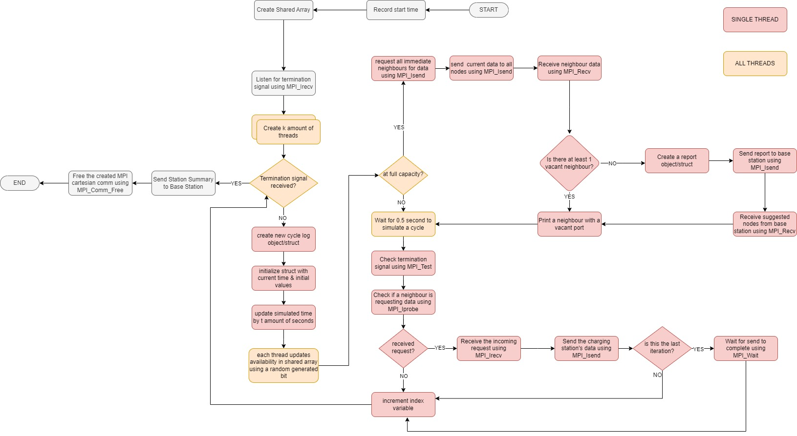
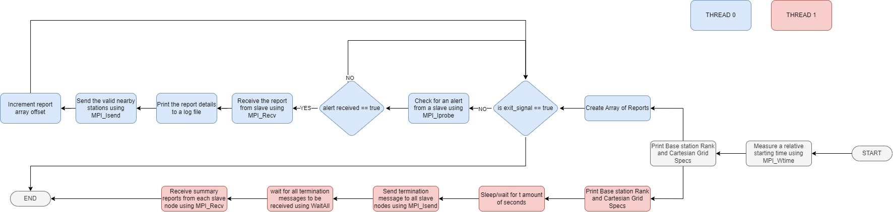

# MPI Simulation of a Wireless Sensor Network
 
# Electrical Vehicle Charging Nodes Logic

This simulation focuses on constructing a wireless sensor network (WSN) comprising a series of interconnected EV charging nodes. The EV nodes are set up in a Cartesian grid layout, representing a simple configuration of the EV charging stations. It's important to note that the actual number of nodes may differ based on the specific area under observation.

The layout ensures that each charging node communicates with its adjacent nodes (e.g., up, down, left, and right in the Cartesian grid layout). Each EV charging node is equipped with a varying number of in-use or free charging ports. In situations where all ports, or a significant majority of them, are in full use, the node will request data from its neighboring nodes. If the received data from the neighbors also indicates heavy utilization of their ports, the reporting node will alert the base station that the node and its quadrant are reaching full capacity.

The base station serves as the central recipient of data from the nodes, logging the information for analysis and monitoring purposes.

# EV Charing Station Logic

# Base Station Logic

## Prerequisites

- Ensure that the MPI library is installed on your system.

## How to Run

The program can be executed with the following arguments:

- <number of rows>: Specifies the number of rows in the simulated WSN grid.
- <number of columns>: Specifies the number of columns in the simulated WSN grid.
- <simulation time>: Represents the duration of the simulation in time units.

### For example:
If we want to simulate a 3x3 grid for 20 seconds
- mpicc wsn.c -o wsn -lm -fopenmp -Wall
- mpirun -oversubscribe -np 10 ./wsn 3 3 20